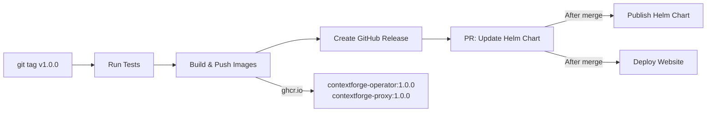

# ContextForge

[](https://github.com/bgruszka/contextforge/actions/workflows/ci.yaml)
[](https://goreportcard.com/report/github.com/bgruszka/contextforge)
[](LICENSE)

**Automatic HTTP Header Propagation for Kubernetes** — Zero code changes required.

ContextForge is a Kubernetes operator that injects a lightweight sidecar proxy to automatically propagate HTTP headers like `x-request-id`, `x-tenant-id`, and `x-correlation-id` through your entire microservice chain.

## The Problem

Modern microservices rely on HTTP headers for request tracing, multi-tenancy, and debugging. But service meshes like Istio, Linkerd, and Consul **don't automatically propagate these headers** — your application must manually extract and forward them.

This means:
- Code changes in every service across multiple languages
- Easy to forget — one missed header breaks the entire trace
- Maintenance burden across your entire fleet

## The Solution

ContextForge injects a sidecar proxy that automatically:

1. **Captures** incoming request headers
2. **Stores** them in request context
3. **Injects** them into all outgoing HTTP requests

All without touching your application code.

## Quick Start

### Install

```bash
helm repo add contextforge https://ctxforge.io
helm install contextforge contextforge/contextforge \
  --namespace ctxforge-system \
  --create-namespace
```

### Enable on Your Pods

```yaml
apiVersion: apps/v1
kind: Deployment
metadata:
  name: my-service
spec:
  template:
    metadata:
      labels:
        ctxforge.io/enabled: "true"
      annotations:
        ctxforge.io/enabled: "true"
        ctxforge.io/headers: "x-request-id,x-tenant-id,x-correlation-id"
    spec:
      containers:
        - name: app
          image: my-app:latest
```

That's it! Headers are now automatically propagated through your service chain.

## Features

- **Zero Code Changes** — Just add Kubernetes annotations
- **Lightweight** — ~10MB memory, <5ms latency overhead
- **Framework Agnostic** — Works with Go, Python, Node.js, Java, Ruby, and more
- **Kubernetes Native** — Uses standard admission webhooks and CRDs
- **Production Ready** — Health checks, graceful shutdown, non-root containers
- **Observable** — Prometheus metrics, structured logging, health endpoints
- **Configurable** — Rate limiting, timeouts, and resource controls
- **Header Generation** — Auto-generate missing headers (UUID, ULID, timestamp)
- **Smart Filtering** — Path regex and HTTP method-based header rules

> **Note:** Header propagation works for **HTTP** traffic. HTTPS requests use CONNECT tunneling where the proxy establishes a TCP tunnel but cannot inspect encrypted headers. For internal service-to-service communication, HTTP is typically used (with mTLS handled by the service mesh if needed).

## Observability

### Prometheus Metrics

The proxy exposes metrics at `/metrics` in Prometheus format:

| Metric | Type | Description |
|--------|------|-------------|
| `ctxforge_proxy_requests_total` | Counter | Total requests processed (labels: `method`, `status`) |
| `ctxforge_proxy_request_duration_seconds` | Histogram | Request duration in seconds (labels: `method`) |
| `ctxforge_proxy_headers_propagated_total` | Counter | Total headers propagated |
| `ctxforge_proxy_active_connections` | Gauge | Current active connections |

### Health Endpoints

| Endpoint | Description |
|----------|-------------|
| `/healthz` | Liveness probe - returns 200 if proxy is running |
| `/ready` | Readiness probe - returns 200 if target is reachable |

### Rate Limiting (Optional)

Enable rate limiting to protect your services:

```yaml
annotations:
  ctxforge.io/enabled: "true"
  ctxforge.io/headers: "x-request-id"
env:
  - name: RATE_LIMIT_ENABLED
    value: "true"
  - name: RATE_LIMIT_RPS
    value: "1000"      # Requests per second
  - name: RATE_LIMIT_BURST
    value: "100"       # Burst size
```

See [docs/configuration.md](docs/configuration.md) for full configuration reference.

## Architecture

```mermaid
flowchart TB
    subgraph pod["Your Kubernetes Pod"]
        direction TB

        req["Incoming Request<br/>x-request-id: abc123<br/>x-tenant-id: acme"]

        subgraph proxy["ContextForge Proxy :9090"]
            p1["1. Extract headers"]
            p2["2. Store in context"]
            p3["3. Forward request"]
            p1 --> p2 --> p3
        end

        subgraph app["Your Application :8080"]
            a1["Process request"]
            a2["Make HTTP call to<br/>another service"]
        end

        out["Outgoing Request<br/>Headers auto-injected!"]

        req --> proxy
        proxy --> app
        a1 --> a2
        app --> out
    end

    style pod fill:#1e293b,stroke:#6366f1,stroke-width:2px
    style proxy fill:#4c1d95,stroke:#a78bfa,stroke-width:2px
    style app fill:#0e7490,stroke:#67e8f9,stroke-width:2px
    style req fill:#1e3a5f,stroke:#60a5fa
    style out fill:#14532d,stroke:#4ade80
```



## Configuration

### Pod Annotations

| Annotation | Description |
|------------|-------------|
| `ctxforge.io/enabled` | Set to `"true"` to enable sidecar injection |
| `ctxforge.io/headers` | Comma-separated list of headers to propagate |
| `ctxforge.io/target-port` | Application port (default: `8080`) |

### HeaderPropagationPolicy CRD

For advanced configuration including header generation and path/method filtering:

```yaml
apiVersion: ctxforge.ctxforge.io/v1alpha1
kind: HeaderPropagationPolicy
metadata:
  name: default-policy
spec:
  podSelector:
    matchLabels:
      app: my-service
  propagationRules:
    # Auto-generate request ID if missing
    - headers:
        - name: x-request-id
          generate: true
          generatorType: uuid  # Options: uuid, ulid, timestamp
        - name: x-tenant-id

    # Only propagate for API paths (excludes /health, /metrics)
    - headers:
        - name: x-debug-id
      pathRegex: "^/api/.*"
      methods:
        - POST
        - PUT
```

## Use Cases

- **Multi-Tenant SaaS** — Propagate tenant ID for data isolation
- **Request Tracing** — Track requests with correlation IDs
- **Developer Debugging** — Add dev ID to trace your requests in staging
- **Compliance & Audit** — Maintain audit trails across services

## Comparison with Other Approaches

### Why Not Use a Service Mesh?

Service meshes like Istio, Linkerd, and Consul provide powerful networking features, but they **don't automatically propagate application-level headers**. Here's a comparison:

| Feature | ContextForge | Istio/Linkerd/Consul |
|---------|--------------|----------------------|
| **Header Propagation** | Automatic, zero code changes | Manual - requires app code changes |
| **Resource Overhead** | ~10MB memory per pod | 50-100MB+ memory per pod |
| **Latency Impact** | <5ms | 1-10ms (varies) |
| **Complexity** | Single operator + CRD | Full mesh control plane |
| **Learning Curve** | Minimal | Significant |
| **mTLS** | Use with mesh | Built-in |
| **Traffic Management** | Not included | Advanced routing, retries, etc. |

### When to Use ContextForge

**Choose ContextForge when:**
- You need header propagation without code changes
- You want minimal resource overhead
- You don't need full service mesh features
- You're using a service mesh but need header propagation

**Choose a Service Mesh when:**
- You need mTLS, traffic management, observability
- You're willing to invest in the operational complexity
- You can modify application code for header propagation

### ContextForge + Service Mesh

ContextForge works alongside service meshes. Use ContextForge for header propagation while the mesh handles mTLS, traffic management, and observability.

```yaml
# Example: ContextForge with Istio
apiVersion: apps/v1
kind: Deployment
metadata:
  name: my-service
  labels:
    sidecar.istio.io/inject: "true"    # Istio sidecar
spec:
  template:
    metadata:
      annotations:
        ctxforge.io/enabled: "true"     # ContextForge sidecar
        ctxforge.io/headers: "x-request-id,x-tenant-id"
```

### Alternative Approaches

| Approach | Pros | Cons |
|----------|------|------|
| **ContextForge** | Zero code changes, lightweight | HTTP only, single-purpose |
| **OpenTelemetry SDK** | Rich instrumentation, standard | Requires code changes per language |
| **Custom Middleware** | Full control | Maintenance burden, per-language |
| **API Gateway** | Centralized | Only at edge, not service-to-service |

## Documentation

Full documentation available at **[ctxforge.io](https://ctxforge.io)**

- [Getting Started](https://ctxforge.io/docs/getting-started/)
- [Installation Guide](https://ctxforge.io/docs/installation/)
- [Configuration Reference](https://ctxforge.io/docs/configuration/)
- [How It Works](https://ctxforge.io/docs/how-it-works/)
- [Examples](https://ctxforge.io/docs/examples/)

## Development

### Prerequisites

- Go 1.24+
- Docker
- kubectl
- kind (for local testing)
- Helm 3+

### Build

```bash
# Build binaries
make build-all

# Build Docker images
make docker-build-all

# Run unit tests
make test

# Run e2e tests (creates Kind cluster, deploys operator, runs tests)
make test-e2e
```

### Local Development

```bash
# Create kind cluster
kind create cluster --name ctxforge-dev

# Install CRDs
make install

# Run operator locally
make run
```

### Release Flow

Releases are automated via GitHub Actions. To create a new release:

```bash
git tag v1.0.0
git push origin v1.0.0
```

This triggers the release workflow:



**What happens:**
1. Tests run to validate the release
2. Multi-arch Docker images (amd64/arm64) pushed to `ghcr.io`
3. GitHub Release created with auto-generated changelog
4. PR created to bump Helm chart version
5. After PR merge: Helm chart published and website updated

## Project Structure

```
contextforge/
├── api/v1alpha1/           # CRD type definitions
├── cmd/
│   ├── proxy/              # Sidecar proxy binary
│   └── main.go             # Operator binary
├── internal/
│   ├── config/             # Configuration loading
│   ├── controller/         # Kubernetes controller
│   ├── handler/            # HTTP proxy handler
│   ├── metrics/            # Prometheus metrics
│   ├── middleware/         # HTTP middleware (rate limiting)
│   ├── server/             # HTTP server
│   └── webhook/            # Admission webhook
├── deploy/
│   └── helm/contextforge/  # Helm chart
├── docs/                   # Documentation
├── website/                # Documentation site
├── tests/e2e/              # E2E tests
├── Dockerfile.proxy        # Proxy image
└── Dockerfile.operator     # Operator image
```

## Contributing

Contributions are welcome! Please read our contributing guidelines and submit pull requests.

1. Fork the repository
2. Create a feature branch (`git checkout -b feature/amazing-feature`)
3. Commit your changes (`git commit -m 'Add amazing feature'`)
4. Push to the branch (`git push origin feature/amazing-feature`)
5. Open a Pull Request

## License

Apache License 2.0 - see [LICENSE](LICENSE) for details.

## Acknowledgments

Built with:
- [kubebuilder](https://kubebuilder.io/) - Kubernetes operator framework
- [controller-runtime](https://github.com/kubernetes-sigs/controller-runtime) - Controller libraries
- [zerolog](https://github.com/rs/zerolog) - Structured logging
