```mermaid
%%{init: {'theme': 'dark', 'themeVariables': { 'fontSize': '16px'}}}%%
flowchart TB
    subgraph pod["☸️ Your Kubernetes Pod"]
        direction TB

        req["📥 Incoming Request<br/>x-request-id: abc123<br/>x-tenant-id: acme"]

        subgraph proxy["🔄 ContextForge Proxy"]
            p1["1. Extract headers"]
            p2["2. Store in context"]
            p1 --> p2
        end

        subgraph app["🚀 Your Application"]
            a1["Makes HTTP call to another service"]
        end

        out["📤 Outgoing Request<br/>x-request-id: abc123 ✓<br/>x-tenant-id: acme ✓<br/>Headers auto-injected!"]

        req --> proxy
        proxy --> app
        app --> out
    end

    style pod fill:#1e293b,stroke:#6366f1,stroke-width:3px,color:#fff
    style proxy fill:#312e81,stroke:#818cf8,stroke-width:2px,color:#fff
    style app fill:#164e63,stroke:#22d3ee,stroke-width:2px,color:#fff
    style req fill:#1e3a5f,stroke:#60a5fa,stroke-width:2px,color:#fff
    style out fill:#14532d,stroke:#4ade80,stroke-width:2px,color:#fff
    style p1 fill:#4c1d95,stroke:#a78bfa,color:#fff
    style p2 fill:#4c1d95,stroke:#a78bfa,color:#fff
    style a1 fill:#0e7490,stroke:#67e8f9,color:#fff
```

<div class="hx-mt-6"></div>


  <span>Open Source</span>
  


<div class="hx-mt-8 hx-mb-8">

  Zero-Code Header Propagation&nbsp;<br class="sm:hx-block hx-hidden" />for Kubernetes

</div>


  Automatically propagate HTTP headers like x-request-id, x-tenant-id,&nbsp;<br class="sm:hx-block hx-hidden" />through your microservice chain — no code changes required.


<div style="height: 2.5rem;"></div>

<div style="margin-bottom: 4rem;">


</div>

<div class="hx-mt-16"></div>


  
  
  
  
  
  


<div class="hx-mt-24"></div>

---

<div style="height: 1rem;"></div>

<h2 style="font-size: 2rem; font-weight: 700; margin-bottom: 1.5rem;">The Problem</h2>

<p style="font-size: 1.1rem; line-height: 1.8; margin-bottom: 1.5rem;">
Modern microservices rely on HTTP headers for <strong>request tracing</strong>, <strong>multi-tenancy</strong>, and <strong>debugging</strong>. Headers like <code>x-request-id</code>, <code>x-tenant-id</code>, and <code>x-correlation-id</code> must flow through every service.
</p>

<p style="font-size: 1.1rem; line-height: 1.8;">
<strong>But service meshes don't help.</strong> Istio, Linkerd, and Consul don't automatically propagate these headers. Your application code must manually extract incoming headers and attach them to every outgoing request.
</p>

<div style="height: 5rem;"></div>

---

<div style="height: 1rem;"></div>

<h2 style="font-size: 2rem; font-weight: 700; margin-bottom: 1.5rem;">Quick Start</h2>

<div style="height: 1rem;"></div>

**1. Install ContextForge:**

```bash
helm repo add contextforge https://ctxforge.io
helm install contextforge contextforge/contextforge -n ctxforge-system --create-namespace
```

<div class="hx-mt-8"></div>

**2. Annotate your pods:**

```yaml
apiVersion: apps/v1
kind: Deployment
metadata:
  name: my-service
spec:
  template:
    metadata:
      labels:
        ctxforge.io/enabled: "true"
      annotations:
        ctxforge.io/enabled: "true"
        ctxforge.io/headers: "x-request-id,x-tenant-id,x-correlation-id"
    spec:
      containers:
        - name: app
          image: my-app:latest
```

<div class="hx-mt-8"></div>

**3. Done!** Headers flow automatically through your service chain.

<div style="height: 5rem;"></div>

---

<div style="height: 1rem;"></div>

<h2 style="font-size: 2rem; font-weight: 700; margin-bottom: 1.5rem;">How It Works</h2>

<div style="height: 1rem;"></div>

<div class="mermaid-container" style="width: 100%; max-width: 1000px; margin: 0 auto;">



</div>

<div style="height: 5rem;"></div>

---

<div style="height: 1rem;"></div>

<h2 style="font-size: 2rem; font-weight: 700; margin-bottom: 2rem;">Get Started</h2>


  
  
  


<div class="hx-mt-16"></div>
