Real-world examples and use cases for ContextForge.

## Multi-Tenant SaaS

Propagate tenant ID through all services for data isolation:

```yaml
apiVersion: apps/v1
kind: Deployment
metadata:
  name: api-gateway
spec:
  template:
    metadata:
      labels:
        ctxforge.io/enabled: "true"
      annotations:
        ctxforge.io/enabled: "true"
        ctxforge.io/headers: "x-tenant-id,x-user-id"
    spec:
      containers:
        - name: gateway
          image: api-gateway:latest
---
apiVersion: apps/v1
kind: Deployment
metadata:
  name: user-service
spec:
  template:
    metadata:
      labels:
        ctxforge.io/enabled: "true"
      annotations:
        ctxforge.io/enabled: "true"
        ctxforge.io/headers: "x-tenant-id,x-user-id"
    spec:
      containers:
        - name: user-service
          image: user-service:latest
---
apiVersion: apps/v1
kind: Deployment
metadata:
  name: billing-service
spec:
  template:
    metadata:
      labels:
        ctxforge.io/enabled: "true"
      annotations:
        ctxforge.io/enabled: "true"
        ctxforge.io/headers: "x-tenant-id,x-user-id"
    spec:
      containers:
        - name: billing-service
          image: billing-service:latest
```

**Flow:**


## Request Tracing

Track requests across microservices with correlation IDs:

```yaml
apiVersion: apps/v1
kind: Deployment
metadata:
  name: order-service
spec:
  template:
    metadata:
      labels:
        ctxforge.io/enabled: "true"
      annotations:
        ctxforge.io/enabled: "true"
        ctxforge.io/headers: "x-request-id,x-correlation-id,x-trace-id"
    spec:
      containers:
        - name: order-service
          image: order-service:latest
```

**Viewing logs across services:**
```bash
# Find all logs for a specific request
kubectl logs -l app=order-service | grep "x-request-id: abc123"
kubectl logs -l app=payment-service | grep "x-request-id: abc123"
kubectl logs -l app=notification-service | grep "x-request-id: abc123"
```

## Telepresence Integration

Seamlessly integrate with [Telepresence](https://www.telepresence.io/) for local development. When using Telepresence intercepts, the `x-telepresence-intercept-id` header must flow through all downstream services for proper routing:

```yaml
apiVersion: apps/v1
kind: Deployment
metadata:
  name: frontend
spec:
  template:
    metadata:
      labels:
        ctxforge.io/enabled: "true"
      annotations:
        ctxforge.io/enabled: "true"
        ctxforge.io/headers: "x-telepresence-intercept-id,x-request-id"
    spec:
      containers:
        - name: frontend
          image: frontend:latest
---
apiVersion: apps/v1
kind: Deployment
metadata:
  name: backend-api
spec:
  template:
    metadata:
      labels:
        ctxforge.io/enabled: "true"
      annotations:
        ctxforge.io/enabled: "true"
        ctxforge.io/headers: "x-telepresence-intercept-id,x-request-id"
    spec:
      containers:
        - name: backend-api
          image: backend-api:latest
---
apiVersion: apps/v1
kind: Deployment
metadata:
  name: database-service
spec:
  template:
    metadata:
      labels:
        ctxforge.io/enabled: "true"
      annotations:
        ctxforge.io/enabled: "true"
        ctxforge.io/headers: "x-telepresence-intercept-id,x-request-id"
    spec:
      containers:
        - name: database-service
          image: database-service:latest
```

**Developer workflow:**
```bash
# Start Telepresence intercept on backend-api
telepresence intercept backend-api --port 8080

# Now requests with your intercept header flow through the entire chain:
# Frontend → Backend API (local) → Database Service
#
# Without ContextForge, only Frontend → Backend API would be intercepted.
# With ContextForge, the x-telepresence-intercept-id header propagates
# to ALL downstream services, so your local backend can call
# database-service and the response comes back to you!
```

**Flow with Telepresence + ContextForge:**


This enables true end-to-end local development where you can debug the backend while still connecting to real cluster services!

---

## Developer Debugging

Add developer ID header to trace requests through staging:

```yaml
# Development namespace configuration
apiVersion: v1
kind: Namespace
metadata:
  name: staging
  labels:
    ctxforge.io/injection: enabled
---
# All pods in staging get these headers propagated
apiVersion: ctxforge.ctxforge.io/v1alpha1
kind: HeaderPropagationPolicy
metadata:
  name: dev-headers
  namespace: staging
spec:
  selector:
    matchLabels: {}  # Match all pods
  propagationRules:
    - headers:
        - name: x-dev-id
        - name: x-request-id
          generate: true
          generatorType: uuid
```

**Developer workflow:**
```bash
# Add your dev ID to requests
curl -H "x-dev-id: alice" https://staging.example.com/api/orders

# View only your requests in logs
kubectl logs -l app=order-service -n staging | grep "x-dev-id: alice"
```

## Compliance & Audit Trail

Maintain audit trails for payment processing:

```yaml
apiVersion: apps/v1
kind: Deployment
metadata:
  name: payment-processor
spec:
  template:
    metadata:
      labels:
        ctxforge.io/enabled: "true"
      annotations:
        ctxforge.io/enabled: "true"
        ctxforge.io/headers: "x-audit-id,x-transaction-id,x-user-id,x-session-id"
    spec:
      containers:
        - name: payment-processor
          image: payment-processor:latest
```

**Application logging:**
```go
// In your application code
func ProcessPayment(ctx context.Context, amount float64) error {
    auditID := ctx.Value("x-audit-id")
    transactionID := ctx.Value("x-transaction-id")

    log.Info("Processing payment",
        "audit_id", auditID,
        "transaction_id", transactionID,
        "amount", amount,
    )

    // Process payment...
}
```

## Feature Flags

Propagate feature flag context for A/B testing:

```yaml
apiVersion: apps/v1
kind: Deployment
metadata:
  name: feature-service
spec:
  template:
    metadata:
      labels:
        ctxforge.io/enabled: "true"
      annotations:
        ctxforge.io/enabled: "true"
        ctxforge.io/headers: "x-feature-flags,x-experiment-id,x-variant"
    spec:
      containers:
        - name: feature-service
          image: feature-service:latest
```

## Custom Port Configuration

If your app runs on a non-standard port:

```yaml
apiVersion: apps/v1
kind: Deployment
metadata:
  name: custom-port-app
spec:
  template:
    metadata:
      labels:
        ctxforge.io/enabled: "true"
      annotations:
        ctxforge.io/enabled: "true"
        ctxforge.io/headers: "x-request-id"
        ctxforge.io/target-port: "3000"  # Node.js default port
    spec:
      containers:
        - name: nodejs-app
          image: nodejs-app:latest
          ports:
            - containerPort: 3000
```

## Full Example: E-Commerce Platform

A complete example showing header propagation across an e-commerce platform:

```yaml
# API Gateway - entry point
apiVersion: apps/v1
kind: Deployment
metadata:
  name: api-gateway
  namespace: ecommerce
spec:
  replicas: 3
  template:
    metadata:
      labels:
        app: api-gateway
        ctxforge.io/enabled: "true"
      annotations:
        ctxforge.io/enabled: "true"
        ctxforge.io/headers: "x-request-id,x-tenant-id,x-user-id,x-session-id"
    spec:
      containers:
        - name: gateway
          image: ecommerce/api-gateway:v1.2.0
          ports:
            - containerPort: 8080
---
# Product Service
apiVersion: apps/v1
kind: Deployment
metadata:
  name: product-service
  namespace: ecommerce
spec:
  replicas: 2
  template:
    metadata:
      labels:
        app: product-service
        ctxforge.io/enabled: "true"
      annotations:
        ctxforge.io/enabled: "true"
        ctxforge.io/headers: "x-request-id,x-tenant-id,x-user-id"
    spec:
      containers:
        - name: products
          image: ecommerce/product-service:v2.0.1
---
# Order Service
apiVersion: apps/v1
kind: Deployment
metadata:
  name: order-service
  namespace: ecommerce
spec:
  replicas: 2
  template:
    metadata:
      labels:
        app: order-service
        ctxforge.io/enabled: "true"
      annotations:
        ctxforge.io/enabled: "true"
        ctxforge.io/headers: "x-request-id,x-tenant-id,x-user-id,x-session-id"
    spec:
      containers:
        - name: orders
          image: ecommerce/order-service:v1.5.0
---
# Payment Service
apiVersion: apps/v1
kind: Deployment
metadata:
  name: payment-service
  namespace: ecommerce
spec:
  replicas: 2
  template:
    metadata:
      labels:
        app: payment-service
        ctxforge.io/enabled: "true"
      annotations:
        ctxforge.io/enabled: "true"
        ctxforge.io/headers: "x-request-id,x-tenant-id,x-user-id,x-transaction-id"
    spec:
      containers:
        - name: payments
          image: ecommerce/payment-service:v1.0.3
---
# Notification Service
apiVersion: apps/v1
kind: Deployment
metadata:
  name: notification-service
  namespace: ecommerce
spec:
  replicas: 1
  template:
    metadata:
      labels:
        app: notification-service
        ctxforge.io/enabled: "true"
      annotations:
        ctxforge.io/enabled: "true"
        ctxforge.io/headers: "x-request-id,x-user-id"
    spec:
      containers:
        - name: notifications
          image: ecommerce/notification-service:v1.1.0
```

**Request flow:**

```mermaid
flowchart TD
    Customer["Customer places order"]
    Gateway["API Gateway<br/>sets x-request-id<br/>extracts x-user-id from JWT"]
    Product["Product Service<br/>validates inventory"]
    Order["Order Service<br/>creates order"]
    Payment["Payment Service<br/>processes payment"]
    Notify["Notification Service<br/>sends confirmation"]

    ProductLog["📝 [ord-123] Checking inventory"]
    OrderLog["📝 [ord-123] Creating order"]
    PaymentLog["📝 [ord-123] Processing $99.99"]
    NotifyLog["📝 [ord-123] Sending email"]

    Customer --> Gateway
    Gateway --> Product
    Gateway --> Order
    Gateway --> Notify
    Order --> Payment

    Product -.-> ProductLog
    Order -.-> OrderLog
    Payment -.-> PaymentLog
    Notify -.-> NotifyLog

    style Customer fill:#1e3a5f,stroke:#60a5fa,color:#fff
    style Gateway fill:#4c1d95,stroke:#a78bfa,color:#fff
    style Product fill:#312e81,stroke:#818cf8,color:#fff
    style Order fill:#312e81,stroke:#818cf8,color:#fff
    style Payment fill:#312e81,stroke:#818cf8,color:#fff
    style Notify fill:#312e81,stroke:#818cf8,color:#fff
    style ProductLog fill:#14532d,stroke:#4ade80,color:#fff
    style OrderLog fill:#14532d,stroke:#4ade80,color:#fff
    style PaymentLog fill:#14532d,stroke:#4ade80,color:#fff
    style NotifyLog fill:#14532d,stroke:#4ade80,color:#fff
```



All services log the same `x-request-id`, making it easy to trace the entire order flow!
