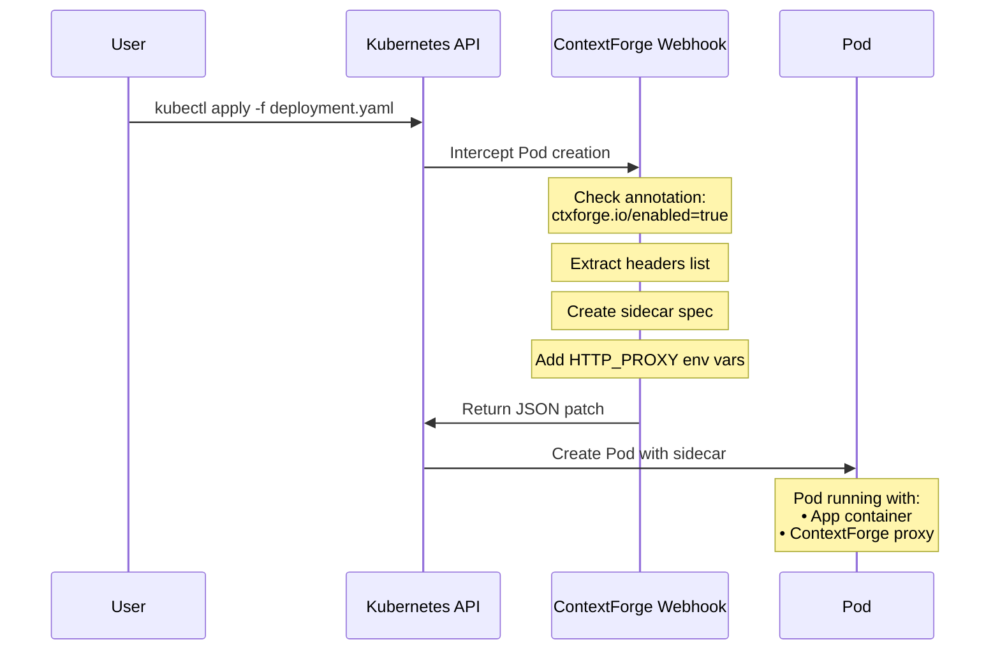
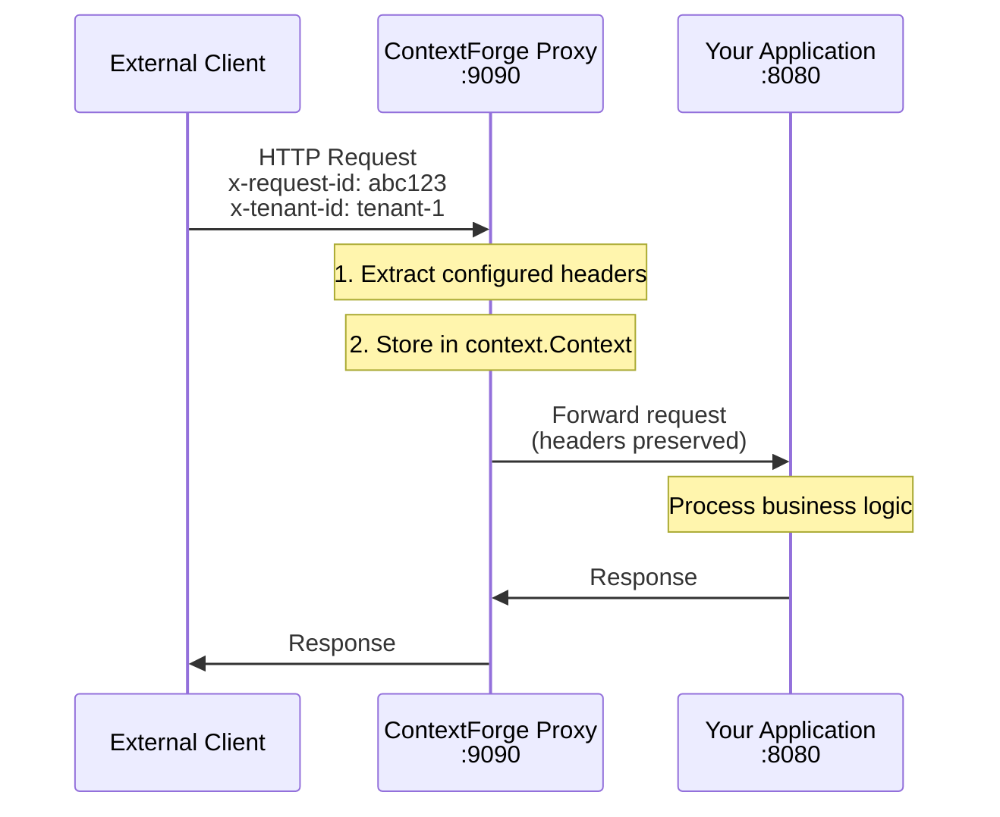
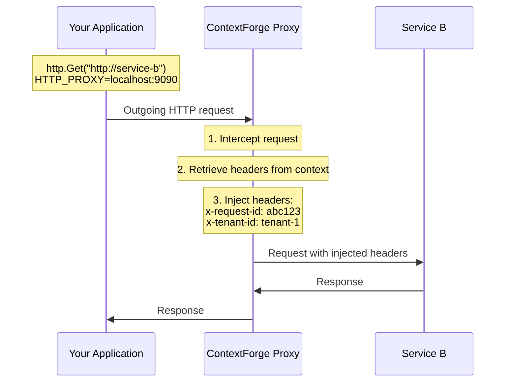
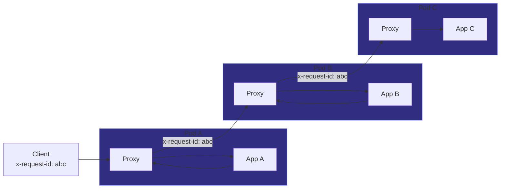

This page explains the architecture and internals of ContextForge.

## Architecture Overview

ContextForge consists of two main components:

1. **Operator** — A Kubernetes controller that watches for pod creation and injects the sidecar
2. **Proxy Sidecar** — A lightweight HTTP proxy that handles header propagation

```mermaid
flowchart TB
    subgraph cluster["Kubernetes Cluster"]
        subgraph operator["ContextForge Operator"]
            webhook["MutatingAdmissionWebhook"]
            webhook --> |"Intercepts Pod creation"| check["Check ctxforge.io/enabled"]
            check --> |"If enabled"| inject["Inject sidecar + HTTP_PROXY"]
        end

        subgraph pod["Application Pod"]
            proxy["ContextForge Proxy<br/>:9090"]
            app["App Container<br/>:8080"]
            proxy --> |"Forward requests"| app
        end

        webhook -.-> |"Patches pod spec"| pod
    end

    style cluster fill:#1e293b,stroke:#6366f1,stroke-width:2px
    style operator fill:#312e81,stroke:#818cf8,stroke-width:2px
    style pod fill:#164e63,stroke:#22d3ee,stroke-width:2px
    style proxy fill:#4c1d95,stroke:#a78bfa
    style app fill:#0e7490,stroke:#67e8f9
```



## Sidecar Injection Flow

When you create a pod with the `ctxforge.io/enabled: "true"` annotation:



## Request Flow

Here's how headers are propagated through a request:

### Incoming Request



### Outgoing Request

When your application makes an HTTP call to another service:



### Full Chain Propagation



## Header Storage

ContextForge uses Go's `context.Context` for thread-safe, request-scoped header storage:

```go
// Simplified implementation
type contextKey string
const ContextKeyHeaders contextKey = "ctxforge-headers"

// Store headers from incoming request
headers := extractHeaders(request, configuredHeaders)
ctx := context.WithValue(request.Context(), ContextKeyHeaders, headers)

// Retrieve headers for outgoing request
if stored := ctx.Value(ContextKeyHeaders); stored != nil {
    for key, value := range stored.(map[string]string) {
        outboundRequest.Header.Set(key, value)
    }
}
```

## HTTP_PROXY Approach

ContextForge leverages the standard `HTTP_PROXY` and `HTTPS_PROXY` environment variables:

```mermaid
flowchart LR
    subgraph pod["Your Pod"]
        app["Application"]
        proxy["ContextForge Proxy<br/>localhost:9090"]
        env["ENV: HTTP_PROXY=localhost:9090"]
    end

    app --> |"All HTTP requests<br/>go through proxy"| proxy
    proxy --> |"Headers injected"| external["External Services"]

    style pod fill:#1e293b,stroke:#6366f1
    style proxy fill:#4c1d95,stroke:#a78bfa
```



1. The operator sets these env vars to point to the sidecar proxy (`localhost:9090`)
2. Most HTTP clients automatically use these proxies for outgoing requests
3. The proxy intercepts outgoing calls and injects headers

{}
**Compatibility:** This approach works with most HTTP clients in Go, Python, Node.js, Java, Ruby, and other languages. Some clients may require explicit configuration to respect proxy env vars.
{}

## Performance

ContextForge is designed for minimal overhead:

| Metric | Value |
|--------|-------|
| Memory per pod | ~10MB |
| CPU per pod | ~10m |
| Latency overhead | <5ms |
| Throughput impact | <1% |

## Health Checks

The proxy exposes health endpoints:

- `/healthz` — Liveness probe (always returns 200)
- `/ready` — Readiness probe (checks if target app is reachable)

## Security

- Runs as non-root user (UID 65532)
- Read-only root filesystem
- No privileged capabilities required
- TLS for webhook communication (cert-manager or self-signed)
