This page documents known limitations and important considerations when using ContextForge.

## HTTPS Traffic

**Header propagation only works for HTTP traffic.** HTTPS requests cannot have headers injected by the proxy.

### Why?

When applications make HTTPS requests through an HTTP proxy, they use the **CONNECT** method to establish a TCP tunnel:

```mermaid
sequenceDiagram
    participant Client
    participant Proxy as ContextForge Proxy
    participant Server as HTTPS Server

    Client->>Proxy: CONNECT example.com:443 HTTP/1.1
    Proxy->>Server: TCP Connection
    Proxy-->>Client: HTTP/1.1 200 Connection Established

    Note over Client,Server: TLS Tunnel Established

    Client->>Server: 🔒 Encrypted TLS Handshake
    Client->>Server: 🔒 Encrypted HTTP Request
    Server->>Client: 🔒 Encrypted HTTP Response

    Note over Proxy: Cannot see or modify<br/>encrypted traffic
```



Once the TLS tunnel is established, the proxy cannot see or modify the encrypted HTTP headers inside the session. This is a fundamental characteristic of how HTTPS works with HTTP proxies.

### HTTP vs HTTPS Comparison

```mermaid
flowchart LR
    subgraph http["HTTP Request"]
        direction LR
        C1[Client] --> P1[ContextForge<br/>Proxy]
        P1 --> S1[Service]
        P1 -.- N1["✅ Can read headers<br/>✅ Can modify headers<br/>✅ Can inject headers"]
    end

    subgraph https["HTTPS Request"]
        direction LR
        C2[Client] --> P2[ContextForge<br/>Proxy]
        P2 --> S2[Service]
        P2 -.- N2["❌ Cannot read headers<br/>❌ Cannot modify headers<br/>❌ CONNECT tunnel only"]
    end

    style http fill:#d4edda,stroke:#28a745
    style https fill:#f8d7da,stroke:#dc3545
```



### Recommendations

For internal service-to-service communication in Kubernetes:

1. **Use HTTP internally** — Most Kubernetes clusters use HTTP for internal traffic, with TLS terminated at the ingress or handled by a service mesh (mTLS)

2. **Service mesh mTLS** — If you use Istio, Linkerd, or another service mesh for mTLS, the traffic between sidecars is encrypted, but your application still makes plain HTTP calls

3. **NO_PROXY for external HTTPS** — If your app needs to call external HTTPS APIs without going through the proxy:
   ```yaml
   annotations:
     ctxforge.io/no-proxy: "api.external.com,*.googleapis.com"
   ```

## Proxy-Aware Clients

The `HTTP_PROXY` environment variable approach works with most HTTP clients, but some may require explicit configuration:

| Language | Status | Notes |
|----------|--------|-------|
| Go (`net/http`) | Works | Automatically respects `HTTP_PROXY` |
| Python (`requests`) | Works | Automatically respects `HTTP_PROXY` |
| Node.js (`axios`) | Works | Automatically respects `HTTP_PROXY` |
| Node.js (`fetch`) | Requires config | Use `node-fetch` with proxy agent |
| Java (`HttpClient`) | Requires config | Set system properties |
| Ruby (`net/http`) | Works | Automatically respects `HTTP_PROXY` |

{}
If your HTTP client doesn't respect `HTTP_PROXY`, you'll need to configure it explicitly to use `http://localhost:9090` as the proxy.
{}

## WebSocket Connections

WebSocket connections are **not supported** for header propagation. The initial HTTP upgrade request may go through the proxy, but subsequent WebSocket frames are not HTTP and cannot be modified.

## gRPC

gRPC uses HTTP/2 and typically doesn't respect the `HTTP_PROXY` environment variable. For gRPC header propagation, consider:

1. Using gRPC interceptors in your application
2. Using a service mesh with native gRPC support

## Header Size Limits

The proxy handles headers up to the standard HTTP limits:

- Individual header value: 8KB
- Total headers size: 32KB

Headers exceeding these limits may be truncated or rejected.

## Performance Overhead

While ContextForge is designed to be lightweight, be aware of:

| Scenario | Additional Latency |
|----------|-------------------|
| Simple request | < 1ms |
| With header injection | < 2ms |
| Large headers (> 1KB) | < 5ms |

For latency-critical paths where even milliseconds matter, consider whether header propagation is necessary for that specific service.

## Single Pod Limitation

The proxy stores headers in memory within the request context. This means:

- Headers are only available within the same request lifecycle
- Async operations that outlive the request won't have access to headers
- Background jobs triggered by the request won't automatically get headers

For async scenarios, you'll need to explicitly pass headers to background workers.
